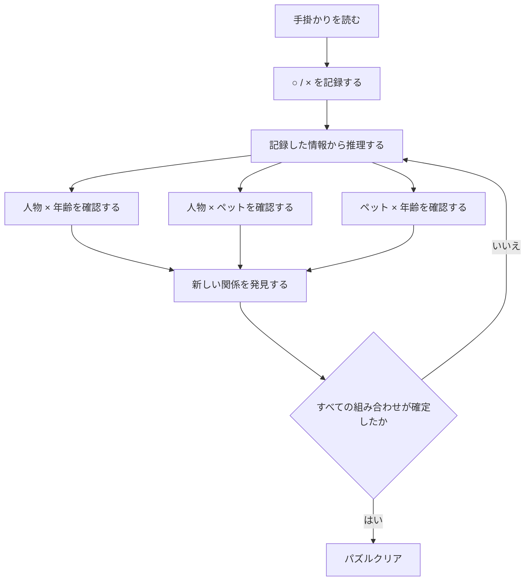
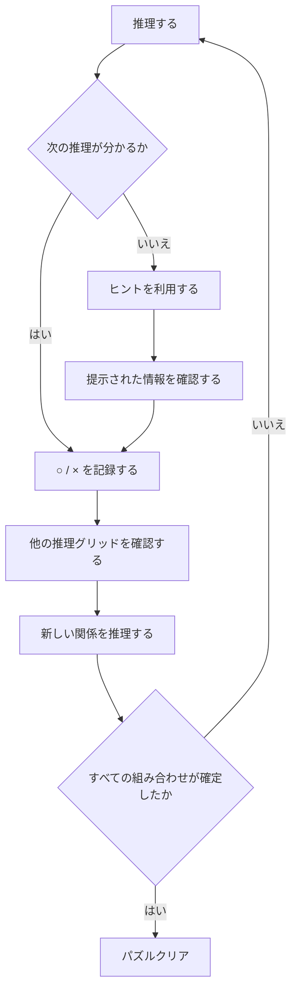

# LogicDetective 概要設計書
#### 目次
<!-- @import "[TOC]" {cmd="toc" depthFrom=1 depthTo=2 orderedList=false} -->

<!-- code_chunk_output -->

- [LogicDetective 概要設計書](#logicdetective-概要設計書)
  - [ゲーム概要](#ゲーム概要)
  - [ゲームの基本的な考え方](#ゲームの基本的な考え方)
  - [ゲーム画面](#ゲーム画面)
  - [手掛かり(Clue)](#手掛かりclue)
  - [複数の推理グリッドを使った推理](#複数の推理グリッドを使った推理)
  - [ゲームの基本フロー](#ゲームの基本フロー)
  - [ヒント](#ヒント)
  - [ゲームの流れ](#ゲームの流れ)
  - [難易度](#難易度)
  - [ゲーム体験](#ゲーム体験)
  - [概要設計の範囲](#概要設計の範囲)

<!-- /code_chunk_output -->

## ゲーム概要

複数のカテゴリに含まれる項目の正しい組み合わせを、与えられた手掛かりにより論理的に推理するパズルゲームである。
例えば、人物, 年齢, ペットの3つのカテゴリがある場合、それぞれに3つの項目がある。
- 人物 : 田中 / 鈴木 / 井上
- 年齢 : 24歳 / 53歳 / 35歳
- ペット : 猫 / 犬 / 魚

プレーヤーは、これらの項目がどのように対応しているのかを、手掛かりを使って特定していく。
最終的には、

- 田中 → 24歳 → 猫
- 鈴木 → 53歳 → 犬
- 井上 → 35歳 → 魚

のように、すべての項目の対応関係を確定させる。

### 「LogicDetective」というタイトルの意味

ゲームタイトルの「LogicDetective」は、
- Logic：論理
- Detective：探偵

を組み合わせた名称である。
プレーヤーは探偵のように、与えられた手掛かりから隠された関係を推理していく。一つ一つの手掛かりを積み重ね、以下の過程を経て、最後にパズルの「真相」を突き止める。
- 手掛かり
- 可能性を絞り込む
- 新しい事実を発見する
- さらに可能性を絞り込む
- 隠された関係を特定する

この「手掛かりを集め、論理的に推理して真相を突き止める」というゲーム性が、タイトルの由来である。そのため、プレーヤーは単に表を埋めるのではなく、**探偵になったつもりで情報を分析し、答えを推理すること**がゲームの基本的な体験となる。

## ゲームの基本的な考え方

カテゴリそのものではなく、**カテゴリ間の対応関係**を推理する。
3つのカテゴリがある場合、2つのカテゴリを組み合わせた関係は3種類ある。

- 人物 × 年齢
- 人物 × ペット
- ペット × 年齢

例えば、`人物 × 年齢`は、

- 田中は24歳なのか？
- 鈴木は53歳なのか？

というように、人物と年齢の対応関係を調べる。

同様に、
- `人物 × ペット`
- `ペット × 年齢`
の対応関係を調べる。
各カテゴリの項目は一対一で対応し、1つの項目に対応する項目は各カテゴリにつき1つだけである。

## ゲーム画面

これらのカテゴリ間の関係を確認するため、ゲーム画面には以下のような階段状の推理グリッドを配置する。この配置が基本的な推理画面である。

### 3カテゴリの場合
3カテゴリの場合の基本的な画面イメージは次のとおりである。

|      | 24歳 | 53歳 | 35歳 | 猫  | 犬  | 魚  |
| ---- | ---- | ---- | ---- | --- | --- | --- |
| 田中 |      |      |      |     |     |     |
| ---- | ---  | ---  | ---  | --- | --- | --- |
| 鈴木 |      |      |      |     |     |     |
| ---- | ---  | ---  | ---  | --- | --- | --- |
| 井上 |      |      |      |     |     |     |
| ==== | ===  | ===  | ===  | === | === | === |
| 猫   |      |      |      |
| ---- | ---  | ---  | ---  |
| 犬   |      |      |      |
| ---- | ---  | ---  | ---  |
| 魚   |      |      |      |
| ---- | ---  | ---  | ---  |

- 凡例：
  - 人物：田中 / 鈴木 / 井上
  - 年齢：24歳 / 53歳 / 35歳
  - ペット：猫 / 犬 / 魚

### 4カテゴリの場合
4カテゴリの場合の基本的な画面イメージは次のとおりである。

|        | 24歳 | 53歳 | 35歳 | 猫  | 犬  | 魚  | 会社員 | 教師 | 公務員 |
| ------ | ---- | ---- | ---- | --- | --- | --- | ------ | ---- | ------ |
| 田中   |      |      |      |     |     |     |        |      |        |
| ----   | ---  | ---  | ---  | --- | --- | --- | ---    | ---  | ---    |
| 鈴木   |      |      |      |     |     |     |        |      |        |
| ----   | ---  | ---  | ---  | --- | --- | --- | ---    | ---  | ---    |
| 井上   |      |      |      |     |     |     |        |      |        |
| ====   | ===  | ===  | ===  | === | === | === | ===    | ===  | ===    |
| 会社員 |      |      |      |     |     |     |
| ----   | ---  | ---  | ---  | --- | --- | --- |
| 教師   |      |      |      |     |     |     |
| ----   | ---  | ---  | ---  | --- | --- | --- |
| 公務員 |      |      |      |     |     |     |
| ====   | ===  | ===  | ===  | === | === | === |
| 猫     |      |      |      |
| ----   | ---  | ---  | ---  |
| 犬     |      |      |      |
| ----   | ---  | ---  | ---  |
| 魚     |      |      |      |
| ----   | ---  | ---  | ---  |

- 凡例：
  - 人物：田中 / 鈴木 / 井上
  - 年齢：24歳 / 53歳 / 35歳
  - ペット：猫 / 犬 / 魚
  - 職業：会社員 / 教師 / 公務員

カテゴリ数は3 or 4を想定する。それ以上多くなると難易度が上がりすぎて人間には解けなくなってくる。

### 推理グリッドの階段状配置

3つのカテゴリごとの推理グリッドは、単純に3枚の表を並べているわけではない。

画面上では、

- 上段左に`人物 × 年齢`
- 上段右に`人物 × ペット`
- 下段に`ペット × 年齢`

を配置する。上記3つの関係が、1つのパズルを構成している。
階段状に配置することで、上段の2つの関係と、それらをつなぐ下段の関係を一つの画面で把握しやすくする。
これは単なる装飾ではなく、**3カテゴリの関係が互いにつながっていることを視覚的に表現するための配置**である。
カテゴリ数を n とした場合、グリッド数は `n × (n − 1) ÷ 2` とする。各推理グリッドは異なる2カテゴリ間の対応関係を表す。

### 推理グリッド間の関係

3つのグリッドは、それぞれ独立したパズルではない。
同じ3カテゴリについて、異なる2カテゴリの組み合わせを表示している。
例えば、`人物 × 年齢`で、`田中 = 24歳`と分かった場合、その情報は、

- 人物 × ペット
- ペット × 年齢

を推理するときにも利用できる。
例えば、

- 田中 = 24歳
- 24歳 = 猫

が分かれば、`田中 = 猫`と推理できる。
このように、3つの推理グリッドを相互に参照することによって、一つの関係から別の関係を導き出す。

### 推理グリッドの意味

各推理グリッドは、2つのカテゴリの対応関係を表す。

#### 人物 × 年齢

|      | 24歳 | 53歳 | 35歳 |
| ---- | ---- | ---- | ---- |
| 田中 |      |      |      |
| ---- | ---  | ---  | ---  |
| 鈴木 |      |      |      |
| ---- | ---  | ---  | ---  |
| 井上 |      |      |      |
| ---- | ---  | ---  | ---  |

行が人物、列が年齢である。
したがって、田中の行と24歳の列が交差するマスは、

> 田中と24歳の組み合わせ

を表す。

#### 人物 × ペット

|      | 猫  | 犬  | 魚  |
| ---- | --- | --- | --- |
| 田中 |     |     |     |
| ---- | --- | --- | --- |
| 鈴木 |     |     |     |
| ---- | --- | --- | --- |
| 井上 |     |     |     |
| ---- | --- | --- | --- |

行が人物、列がペットである。

#### ペット × 年齢

|      | 24歳 | 53歳 | 35歳 |
| ---- | ---- | ---- | ---- |
| 猫   |      |      |      |
| ---- | ---  | ---  | ---  |
| 犬   |      |      |      |
| ---- | ---  | ---  | ---  |
| 魚   |      |      |      |
| ---- | ---  | ---  | ---  |

行がペット、列が年齢である。
この3つの推理グリッドによって、3カテゴリ間のすべての組み合わせを確認できる。

### 推理グリッドのマス

推理グリッドの1つのマスは、2つの項目の組み合わせを表す。

例えば、`田中 × 24歳`というマスは、

> 田中と24歳が同じ組なのか？

を表している。プレーヤーは、手掛かりや自分の推理によって、この組み合わせが正しいのか、正しくないのかを判断していく。

### ○と×の意味

推理グリッドでは、組み合わせの状態を`○`と`×`で表す。
- `○`は、`この2つの項目は同じ組み合わせである`ことを意味する。例えば、`田中 × 24歳 = ○`となった場合、`田中は24歳である`と確定する。
- `×`は、`この2つの項目は同じ組み合わせではない`ことを意味する。例えば、`田中 × 35歳 = ×`となった場合、`田中は35歳ではない`と確定する。

### ○と×による絞り込み

正しい組み合わせを見つけるだけではなく、間違った組み合わせを排除することも重要である。
例えば、以下のようになった場合、

|      | 24歳 | 53歳 | 35歳 |
| ---- | ---- | ---- | ---- |
| 田中 | ×    | ○    | ×    |
| ---- | ---  | ---  | ---  |
| 鈴木 | ○    | ×    | ×    |
| ---- | ---  | ---  | ---  |
| 井上 | ×    | ×    | ○    |
| ---- | ---  | ---  | ---  |

以下が確定する。

- 田中 = 53歳
- 鈴木 = 24歳
- 井上 = 35歳

このように、`○`による確定と`×`による排除を組み合わせて答えを絞り込んでいく。

## 手掛かり(Clue)

ゲームでは、最初からすべての組み合わせが分かっているわけではない。プレーヤーには、答えを導くための手掛かりが与えられる。例えば、`田中は24歳である。`という手掛かりがあれば、`田中 × 24歳`を○にできる。すると、田中について他の年齢は該当しないため、`田中 × 53歳 = ×, 田中 × 35歳 = ×`と判断できる。一つの手掛かりから複数の情報を導き出せることが、ゲームの基本的な仕組みである。

### 手掛かり種別

手掛かりは以下の通り複数種別ある。

- 肯定手掛かり(Positive) : 2つの項目が同じ組み合わせであることを示す。
  - 田中は24歳です。
- 否定手掛かり(Negative) : 2つの項目が同じ組み合わせではないことを示す。
  - 田中は24歳ではありません。
- 比較手掛かり(Comparison) : 複数の項目の関係を比較することで、組み合わせを絞り込める。
  - 手掛かり : `田中は鈴木より若い。`
  - 比較条件を満たさない候補を排除することで推理を進める。
- 条件手掛かり(Conditional) : 複数の条件を組み合わせることで、組み合わせを絞り込める。
  - 手掛かり : `田中が35歳であるなら、田中のペットは猫です。`の場合、
    - `田中 = 35歳`が確定したときに、`田中 = 猫`を導出できる。
    - `田中 ≠ 35歳`だけから、`田中 ≠ 猫`を導くことはできない。
    - `田中のペットは犬`(猫ではない)と確定した場合、`田中は35歳ではない`を導出できる(対偶推理)。
  - 条件が成立しているかどうかを区別して扱う論理処理が必要となる。

肯定・否定の手掛かりだけを処理できればよいわけではない。比較、条件という、より複雑な論理関係を解釈できる推理機構が必要になる。

## 複数の推理グリッドを使った推理

一つの推理グリッドだけを完成させればよいわけではない。

例えば、`人物 × 年齢`で、`田中 = 24歳`が分かったとする。
また、`人物 × ペット`で、`田中 = 猫`が分かったとする。
すると、田中について、`田中 = 24歳 = 猫`という3カテゴリの関係が分かる。
さらに、`ペット × 年齢`の推理グリッドでは、`猫 = 24歳`という関係を確認できる。
このように、異なる推理グリッドで得られた情報を組み合わせることで、単独の推理グリッドだけでは分からなかった関係を導き出していく。

このため、推理アルゴリズムは一回の判断だけで終了するものではない。新しい事実が得られるたびに、それを利用してさらに導出可能な事実を探す必要がある。新しい情報が導出できなくなるまで推理を継続する仕組みが必要となる。

### 推理の連鎖

一つの確定情報が次の推理につながる。

例えば、`田中 = 24歳`が確定すると、`田中 ≠ 53歳, 田中 ≠ 35歳`が分かる。
さらに、`24歳 = 猫`が確定すれば、`田中 = 猫`も導き出せる。
そして、`田中 = 24歳 = 猫`という関係が確定する。
このように、

- 手掛かり
- 一つの関係を確定
- 他の可能性を排除
- 別の推理グリッドで新しい関係を発見
- さらに可能性を排除
- 新しい関係を確定
- 最終的な組み合わせを完成

という推理の連鎖がゲームの中心となる。

## ゲームの基本フロー

プレーヤーは、次のサイクルを繰り返してパズルを解いていく。

### 正解とは

正解とは、すべてのカテゴリの項目間に成立する一意の対応関係である。正解はゲーム開始時点ですでに確定している。プレーヤーは手掛かりと推理によって、その正解を発見していく。正解はプレーヤーの推理によって変更されない。

### プレーヤーの推理状態

推理状態には、以下の3種類がある。

- 確定した`○`
- 確定した`×`
- まだ判断できない関係

`推理状態 = 正解`とは限らない。
現在判明している情報とパズルの制約(下記の一対一制約)から、新たに確定できる関係を導き出すことを推理と呼ぶ。

### 一対一制約

各カテゴリの項目は一対一で対応する。
- 一つの項目が同じカテゴリの複数項目と対応することはない。
  - 違反例 : `田中 = 24歳, 田中 = 35歳`, `田中 = 24歳, 田中 ≠ 24歳`
- `○`が確定すれば、同じ項目に対する他の候補は×になる。
- ある項目との対応候補が1つを残して全て×になった場合、その残った1つは`○`になる。
- 各カテゴリの項目数は必ず同数である。
  - 人物の項目数が3なら、年齢の項目数もペットの項目数も必ず3。
  - 2つのカテゴリの関係を表す推理グリッドは必ず正方形になる。
- 各カテゴリ間の関係を相互に利用できる。
  - `田中 = 24歳`が確定すると、`田中 ≠ 53歳, 田中 ≠ 35歳`が導かれる。
  - 同時に、24歳が田中に対応すると確定したため、`鈴木 ≠ 24歳, 井上 ≠ 24歳`も導かれる。

## ヒント

プレーヤーが推理に行き詰まった場合は、ヒントを利用できる。ヒントは、単純に答えを表示するためのものではない。プレーヤーが現在までに分かっている情報をもとに、**次にどのような推理が可能なのか**を示し、推理を前に進めるための補助として使用する。ヒントを利用した場合も、プレーヤーは提示された情報をもとに自分自身でグリッドを確認し、次の推理を行う。

### ヒントの例
- 田中が24歳だと分かっているため、田中の他の年齢について×を付けられます。

### ヒントを利用する場合のフロー

### 手掛かりとヒントの違い
- 手掛かり : パズルを解くための元となる情報。ゲーム開始時からプレーヤーに与えられる。
- ヒント : プレーヤーが推理に行き詰まった際に、次に可能な推理を示すための補助情報。

ヒントを利用した場合も、プレーヤー自身がその情報をもとに推理グリッドを確認し、推理を進める。したがって、手掛かりは「パズルを構成する情報」であり、ヒントは「パズルを解くプレーヤーを補助する仕組み」である。

## ゲームの流れ

### パズル開始時

ゲーム開始時には、推理グリッド上の組み合わせはまだ確定していない。プレーヤーは、手掛かりを読みながら必要なマスに`○`や`×`を記録していく。最初は可能性が多数残っている。

### パズルが進んだ状態

推理を進めるにつれて、推理グリッド上の`○`と`×`が増えていく。例えば、

|      | 24歳 | 53歳 | 35歳 |
| ---- | ---- | ---- | ---- |
| 田中 | ×    | ○    | ×    |
| ---- | ---  | ---  | ---  |
| 鈴木 | ○    | ×    | ×    |
| ---- | ---  | ---  | ---  |
| 井上 | ×    | ×    | ○    |
| ---- | ---  | ---  | ---  |

となれば、人物と年齢の関係はすべて確定する。しかし、ゲーム全体ではまだ、

- 人物 × ペット
- ペット × 年齢

の関係を確認する必要がある。そのため、プレーヤーは画面全体を見ながら推理を続ける。

### パズルクリア

最終的には、各人物に1つの年齢と1つのペットが対応し、すべての人物・年齢・ペットの組み合わせが重複なく決まる。
例えば、

- 田中 = 24歳 = 猫
- 鈴木 = 35歳 = 魚
- 井上 = 53歳 = 犬

という状態が完成すれば、パズルの答えが確定する。
パズルクリアとは、単に一つの推理グリッドが埋まることではない。
**すべてのカテゴリ間の関係が一意に確定し、各項目の組み合わせが完成した状態**を意味する。

## 難易度

難易度は、単純に手掛かりの数だけでは決まらない。
重要なのは、

> **手掛かりから最終的な答えに到達するまでに、どれだけの推理を必要とするか**

である。以下がプレーヤーがパズルを解く時の流れ。
- 簡単なパズル
  - 手掛かりを解釈
  - 直接的な確定
  - 答えが完成
- 難しいパズル
  - 手掛かりを解釈
  - 最初の確定
  - 複数の×を導出
  - 別の推理グリッドへ情報を反映
  - 新しい関係を発見
  - 複数の情報を組み合わせる
  - さらに推理
  - 最終的な組み合わせを確定

したがって、プレーヤーがどれだけ多くの情報を覚えているかよりも、**与えられた情報を組み合わせて論理的に答えを導くこと**が重要になる。

以下の要素により難易度が決まる。
- 直接的な推理だけで解けるか
- 数段階の推理が必要か
- 推理が複数の推理グリッドを横断するか
- 複数の手掛かりを組み合わせる必要があるか

## ゲーム体験

中心的なゲーム体験は、

> **手掛かりを読み、推理グリッドに`○`と`×`を記録し、複数の推理グリッドを相互に参照しながら、隠れている組み合わせを論理的に発見すること**

である。プレーヤーは、一つの手掛かりから得た情報を別の推理グリッドの推理にも利用する。その結果、新しい`○`や`×`が生まれ、さらに新しい推理が可能になる。この推理の連鎖を繰り返し、最終的にすべてのカテゴリの対応関係を完成させる。「Detective」という名前が示すとおり、ゲームの本質は**表を機械的に埋めることではなく、手掛かりを集めて論理的に真相を突き止めること**にある。

## 概要設計の範囲

この概要設計では、プレーヤーから見たゲーム内容を定義する。対象とするのは、

- ゲームの目的
- カテゴリの概念
- 推理グリッドの役割
- 複数カテゴリにおける複数の推理グリッド
- 推理グリッドの階段状配置
- 各推理グリッドの行と列
- `○`と`×`の意味
- 手掛かりによる推理
- 複数の推理グリッドを使った推理
- 推理の連鎖
- ヒントの役割
- パズルの難易度
- パズルクリアの考え方

である。
以下の内容は概要設計では扱わない。

- クラス構成
- ソースコード
- 内部データ構造
- Solverの実装
- パズル生成アルゴリズム
- 内部アルゴリズム
- テストコード
- データベース
- API
- UI内部実装
