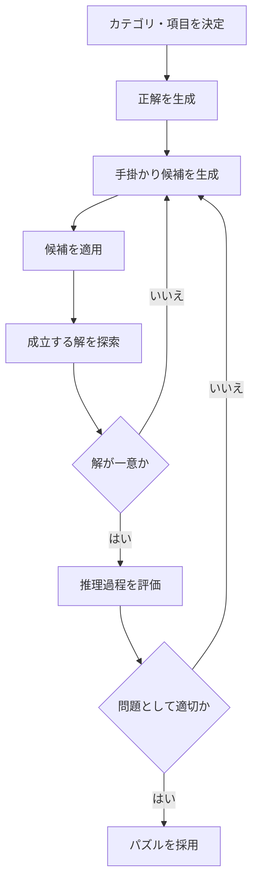
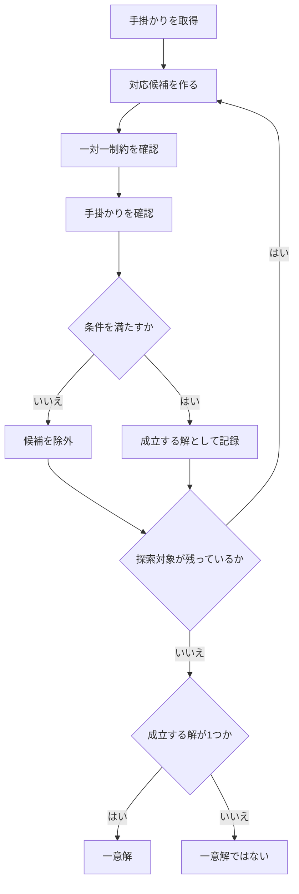
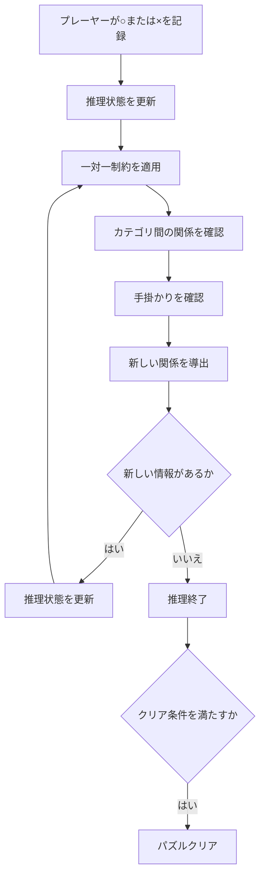
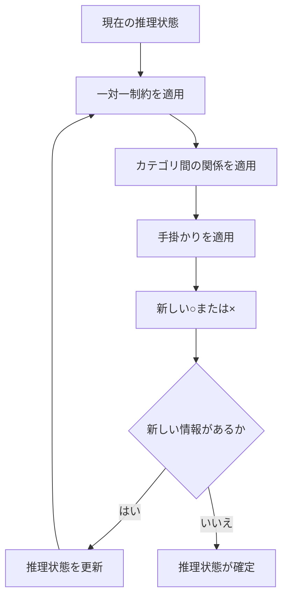
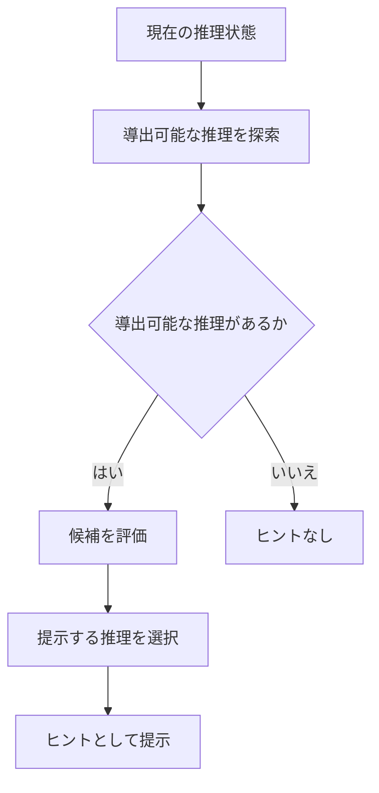

# LogicDetective 基本設計書

#### 目次
<!-- @import "[TOC]" {cmd="toc" depthFrom=1 depthTo=2 orderedList=false} -->

<!-- code_chunk_output -->

- [LogicDetective 基本設計書](#logicdetective-基本設計書)
      - [目次](#目次)
  - [パズル生成](#パズル生成)
  - [一意解](#一意解)
    - [解探索](#解探索)
  - [手掛かりの生成](#手掛かりの生成)
  - [パズルの内部表現](#パズルの内部表現)
  - [手掛かりの内部表現](#手掛かりの内部表現)
  - [正解生成](#正解生成)
  - [手掛かり候補の生成](#手掛かり候補の生成)
  - [一意解の判定](#一意解の判定)
  - [推理可能性の判定](#推理可能性の判定)
  - [難易度の評価](#難易度の評価)
    - [難易度の評価要素](#難易度の評価要素)
    - [最終解までに必要な推理の段階数](#最終解までに必要な推理の段階数)
    - [スコア化](#スコア化)
  - [プレーヤーの推理処理](#プレーヤーの推理処理)
  - [推理情報の伝播](#推理情報の伝播)
  - [手掛かりによる推理](#手掛かりによる推理)
  - [比較手掛かりの判定](#比較手掛かりの判定)
  - [条件手掛かりの判定](#条件手掛かりの判定)
  - [推理の収束](#推理の収束)
  - [ヒントの生成](#ヒントの生成)
  - [矛盾判定](#矛盾判定)
  - [パズルクリア判定](#パズルクリア判定)
  - [ヒント診断](#ヒント診断)
    - [ヒント診断の目的](#ヒント診断の目的)
    - [ヒント診断の対象](#ヒント診断の対象)
    - [ヒント診断の観点](#ヒント診断の観点)
    - [ヒント診断結果](#ヒント診断結果)
  - [推理処理の共通化](#推理処理の共通化)

<!-- /code_chunk_output -->

## パズル生成

パズル生成では、カテゴリと項目だけを作ればよいわけではない。パズルとして成立させるためには、以下を考慮する必要がある。

- 正解となる対応関係
- 手掛かり
- 一意に解けること
- 適切な推理過程
- 適切な難易度

パズル生成は、以下の流れで行う。

手掛かりを追加するたびに、現在の手掛かりだけから成立する解を確認する。解が複数存在する場合は手掛かりが不足しているため、追加の手掛かり候補を選択する。解が一つになった場合でも、プレーヤーが論理的に到達できない場合は採用しない。

## 一意解

手掛かりから複数の異なる答えが成立してはいけない。例えば、

- 解A : `田中 = 24歳 = 猫`
- 解B : `田中 = 35歳 = 猫`

の両方が手掛かりと矛盾しない場合、プレーヤーは論理的に一つの答えを選択できない。したがって、パズル生成時に、手掛かりから成立する解を探索し、**解が一つだけ存在することを確認するアルゴリズム**が必要となる。

### 解探索

解探索では、カテゴリ間の対応候補を調べ、手掛かりと一対一制約を満たす組み合わせだけを残す。解探索の結果について、成立する解を数える。パズルとして採用できるのは、解が1個の場合だけである。

## 手掛かりの生成

手掛かりは、正解から機械的にランダム生成するだけではなく、最終的にプレーヤーが論理的に解けることを考慮して以下の順番で生成する必要がある。

- 正解を生成
- 手掛かり候補を生成
- 候補から解を探索
- 一意解の評価
- 推理過程を評価
- 手掛かりとして採用

特に難易度を考慮する場合、単に一意解を保証するだけでは不十分である。

## パズルの内部表現

パズルは以下のデータを保持する構成とする。

- パズル
  - カテゴリリスト
    - カテゴリ1
      - 項目1-1
      - 項目1-2
      - 項目1-3
    - カテゴリ2
      - 項目2-1
      - 項目2-2
      - 項目2-3
    - カテゴリ3
      - 項目3-1
      - 項目3-2
      - 項目3-3
  - 正解
  - 手掛かり

## 手掛かりの内部表現

手掛かりは、文章そのものだけでなく、推理に必要な条件を保持する。手掛かりには少なくとも以下の情報を持たせる。これにより、文章の解析そのものに依存せず、手掛かりの論理条件を判定できる。

- 文章(Text)
  - 例 : `田中が35歳であるなら、田中のペットは猫です。`
- 手掛かり種別(Type)
  - 例 : `条件手掛かり`
- 対象となる項目
  - 例 : `田中, 35歳, 猫`
- 推理に使用する論理条件(Condition)
  - 例 : `田中 = 35歳`
- 成立した場合に示される関係(Result)
  - 例 : `田中 = 猫`

## 正解生成

正解生成では、乱数を使ってカテゴリ間の対応関係を一対一となるように決定する。例えば人物を基準とした場合、

- 田中 → 24歳
- 鈴木 → 35歳
- 井上 → 53歳

という対応を決定し、その後、別カテゴリとの対応を決定する。
3カテゴリの場合は、

- 人物 → 年齢
- 人物 → ペット

を決定することで、3カテゴリ間の正解が完成する。
正解生成後には、すべての対応関係について一対一制約を確認する。

## 手掛かり候補の生成

手掛かり候補は、確定した正解を基準として生成する。

例えば正解が、`田中 = 24歳 = 猫`であれば、
- 田中は24歳です。
- 田中は犬ではありません。

などの候補を生成できる。
比較、条件についても、正解と矛盾しない条件から候補を生成する。

候補を生成した段階では、その手掛かりがパズルとして有効であるとは判断しない。候補を一つずつ評価し、

- 正解と矛盾しない
- 不要な重複がない
- 一意解に寄与する
- プレーヤーが論理的に利用できる

などの条件を満たしたものを採用する。

## 一意解の判定

一意解の判定では、手掛かりを満たす可能性のある対応関係をすべて探索する。

解が一つの場合だけ、一意解として成立する。解なしの場合は、手掛かり同士が矛盾しているため、その組み合わせはパズルとして採用しない。解が複数の場合は、手掛かりだけでは正解を一意に特定できないため、追加の手掛かりが必要となる。

## 推理可能性の判定

一意解であることと、プレーヤーが論理的に解けることは別である。例えば、最終的には一意解になるものの、その答えに到達するために総当たりが必要になる場合は、論理パズルとして適切ではない。そのため、パズル生成時には、手掛かりから`○`や`×`を論理的に導出し、推理が進行することを確認する。

推理可能性の判定では、以下を順番に適用する。
- 初期手掛かり
- 直接導出
- 一対一制約による導出
- カテゴリ間の対応による導出
- 比較・条件による導出
- 新しい情報があるか
  - ある → 再度推理
  - ない → 推理終了

推理によって正解まで到達できる場合、論理的に解けるパズルとして扱う。

## 難易度の評価

難易度は手掛かりの数だけでは評価しない。推理が何段階必要だったか、どの種別の推理が必要だったかを評価対象とする。

### 難易度の評価要素
主な評価要素は以下とする。
- 直接的に確定できる情報の数
- `×`による排除が必要な回数
- 一対一制約による確定回数
- 複数カテゴリをまたぐ推理の回数
- 複数の手掛かりを組み合わせる必要性
- 条件手掛かりを利用する必要性
- 比較手掛かりを利用する必要性
- 推理の最大連鎖長
- 推理が停滞する状態の有無
- 最終解までに必要な推理の段階数

### 最終解までに必要な推理の段階数
特に以下の通り、最初の手掛かりから最終解までに必要な推理の段階数を、難易度評価の主要な指標とする。
- 初期手掛かり
- 確定
- 排除
- 別カテゴリへ伝播
- 新しい確定
- さらに排除

### スコア化
難易度の評価結果をスコア化し、以下の指標で分類する。
- Easy
- Normal
- Hard
- Expert

## プレーヤーの推理処理

プレーヤーが入力した`○`や`×`は、現在の推理状態に反映する。
その後、確定した情報から新たに導出できる関係を探索する。

一度の入力だけで推理を終了せず、新しい情報によってさらに導出可能な情報がないかを確認する。

## 推理情報の伝播

各カテゴリの対応関係は独立して扱わない。

例
- `田中 = 24歳, 24歳 = 猫`が確定した場合、`田中 = 猫`を導出。
- `田中 = 猫, 猫 = 24歳`が確定した場合、`田中 = 24歳`を導出。

このため、推理状態の更新後には、関連するすべてのカテゴリ間の関係を確認する。
一つの関係の確定が、他の2つの関係に影響する可能性がある。

## 手掛かりによる推理

手掛かりは、手掛かり種別ごとに成立条件を判定する。
- 肯定手掛かりの場合は、指定された2項目を`○`として確定する。
- 否定手掛かりの場合は、指定された2項目を`×`として確定する。
- 比較、条件については、現在の推理状態において条件が成立しているかを確認し、成立した場合に導出可能な関係を追加する。対偶推理についても対応する。
- 手掛かりによる導出だけでなく、手掛かりによって生じた`○`や`×`から一対一制約による導出も行う。

## 比較手掛かりの判定

比較手掛かりでは、対象となる項目の候補を比較する。

例
`田中は鈴木より若い。`という条件の場合、`田中の年齢 < 鈴木の年齢`を満たさない組み合わせを候補から除外する。比較手掛かりでは、単純に一つのマスを`○`にするのではなく、比較条件を満たさない候補を排除する。

比較対象となるカテゴリには順序が必要である。

## 条件手掛かりの判定

条件手掛かりは、`AならばB`という関係として扱う。

例
- 条件 : `田中が35歳であるなら、田中のペットは猫です。`の場合、
  - `田中 = 35歳`が確定していれば、`田中 = 猫`を導出する。
  - 一方、`田中 ≠ 35歳`だけでは、`田中 ≠ 猫`を導出しない。

したがって、条件手掛かりでは、

- 条件が成立している
- 条件が成立していない
- 条件の成立がまだ判断できない

を区別する。条件が成立している場合だけ、結果となる関係を確定する。
条件手掛かりは対偶推理を許可する。

## 推理の収束

推理は、新しい情報が得られなくなるまで繰り返す。一回の推理で得られた情報を次の推理条件として使用するため、推理処理は反復的に行う。

新しい情報が発生しなくなった時点を、その時点での推理の収束とする。
収束した時点で、

- すべての関係が確定している
- まだ未確定の関係が存在する
- 矛盾が発生している

のいずれかを判定する。

## ヒントの生成

ヒントは、プレーヤーの現在の推理状態から、次に論理的に導出可能な情報を選択して提示する。ヒント生成では、正解を直接参照して答えを表示するのではなく、プレーヤーが現在持っている情報から導出可能な推理を対象とする。

ヒントとして提示する情報は、例えば、`田中が24歳であることから、田中の他の年齢はすべて除外できます。`のように、プレーヤーが次に確認すべき論理的な関係を示すものとする。ヒントによって直接答えを表示するのではなく、プレーヤー自身が推理グリッド上で`○`や`×`を確認できる形を基本とする。

## 矛盾判定

推理状態に以下のような矛盾が発生した場合、その状態を不正な推理状態として扱う。矛盾が発生した場合は、その状態を正しい推理結果として扱わない。

- 同一項目に複数の`○`が存在する場合。
  - 例 : `田中 = 24歳, 田中 = 35歳`
- 同じ対応関係に`○`と`×`が同時に存在する場合。
  - 例 : `田中 = 24歳, 田中 ≠ 24歳`
- 一つも対応候補が残っていない場合
  - 例 : `田中 × 24歳, 田中 × 53歳, 田中 × 35歳`

## パズルクリア判定

パズルクリアは、一つの推理グリッドが完成した時点では成立しない。すべてのカテゴリについて対応関係が一意に確定していることを確認する。3カテゴリの場合、
- 人物 → 年齢
- 人物 → ペット
- ペット → 年齢

のすべてについて対応関係が確定していることを確認する。最終状態では以下を満たす必要がある。

- 矛盾がない。
- 一対一制約を満たしている。
- すべてのカテゴリの項目が対応付けられている

## ヒント診断

パズルの状態に対して適切な推理を提示できるかを診断する。パズル評価用の機能であり、プレーヤーが使用するものではない。
ヒント診断ではヒント機能を多数のパズルに対して繰り返し実行し、ヒントが適切に機能しているかを確認するために使用する。

### ヒント診断の目的

ヒント診断の目的は、ヒント機能について次の事項を確認することである。

- ヒントを提示できるパズル状態が適切に検出されること。
- ヒントによって提示された推理が有効であること。
- プレーヤーが既に知っている情報と矛盾するヒントが提示されないこと。
- ヒントによって新しい推理が可能になること。
- ヒントを利用しても、パズルの正解そのものを直接表示してしまわないこと。
- ヒント機能が多数のパズルに対して安定して動作すること。
- ヒント診断は通常のプレーヤー向けゲーム機能ではない。これは開発・テスト時にヒント機能の品質を確認するための診断機能である。したがって、通常のゲームプレイでは使用しない。

### ヒント診断の対象

ヒント診断対象は、通常のゲームで使用されるヒント機能である。ヒント診断では、パズルそのものの正解を求めることだけを目的としない。ヒントがプレーヤーの現在の推理状態を考慮し、以下のゲーム上の流れを成立させられるかを確認する。

- 現在の推理状態
- 次に可能な推理を発見
- プレーヤーに提示可能なヒント
- プレーヤーがグリッドを確認
- 新しい`○`, `×`を記録
- さらに推理

また、一つのパズルについて複数の推理段階を確認することで、序盤だけでなく、推理が進んだ状態でもヒントが機能することを確認する。

### ヒント診断の観点

ヒント診断では、少なくとも次の観点を確認する。

- ヒントが存在するか
  - 現在の推理状態から、プレーヤーが次に進める推理が存在する場合、それをヒントとして提示できることを確認する。
- ヒントが正しいか
  - 提示されたヒントから導かれる関係が、パズルの正解と矛盾しないことを確認する。
- ヒントが新しい情報につながるか
  - プレーヤーが既に知っている情報をそのまま繰り返すのではなく、次の`○`や`×`、または新しい関係の発見につながるヒントであることを確認する。
- ヒントが現在の推理状態を考慮しているか
  - 既に確定している関係や、既に`×`となっている組み合わせを再びヒントとして提示しないことを確認する。
- ヒントが答えを直接表示していないか
  - ヒントはプレーヤー自身の推理を補助するものである。最終回答を直接提示するのではなく、プレーヤーがグリッドを確認して次の推理を行える情報を提示することを確認する。
- 複数グリッドを考慮した診断
  - ヒント診断では、特定のグリッドだけを確認するのではなく、複数のグリッドを相互に利用した推理が適切に扱われることを確認する。これは中心的なゲーム性である「推理の連鎖」をヒント機能が適切に支援できることを確認するためである。

### ヒント診断結果

ヒント診断結果では、各パズルについてヒントの診断結果を確認できるものとする。
ヒント診断結果には、少なくとも次の情報を含める。

- ヒント診断対象となったパズル
- ヒント診断結果
- ヒントを提示できたか
- ヒントが有効だったか
- ヒントによって新しい推理が可能になったか
- 問題が発生した場合の内容

全体結果として、診断対象となったパズルの件数と、問題が発生した件数を確認できるようにする。

## 推理処理の共通化

推理処理は以下の通り複数の場面で行われる。
- パズル生成時 : 生成した手掛かりから正解を一意に導けることを確認する。
- ゲーム中 : プレーヤーが入力した情報と手掛かりから、同じ制約に基づいて新しい関係を導出する。
- ヒント診断時 : 開発者がデバッグに多数のパズルに対してヒント診断を行う際に、正解を一意に導けることを確認する。

上記の推理処理は共通ロジックとし、各場面で同じロジックを使用する。これにより、生成時には解けると判定されたパズルが、ゲーム中の推理では解けないと言った不整合を防止する。
