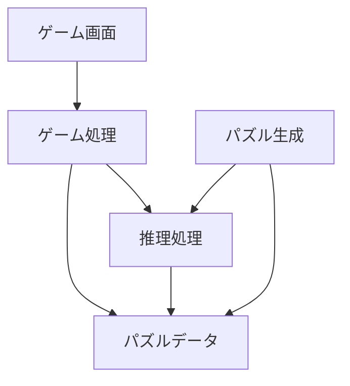
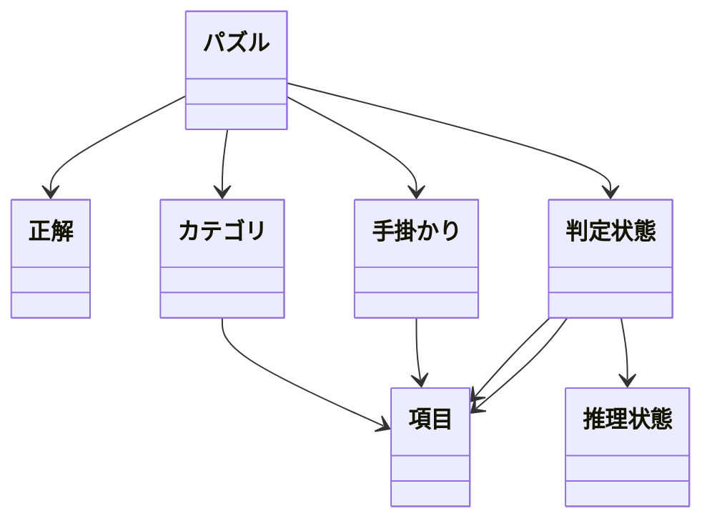

# LogicDetective 詳細設計書

<!-- @import "[TOC]" {cmd="toc" depthFrom=1 depthTo=2 orderedList=false} -->

<!-- code_chunk_output -->

- [LogicDetective 詳細設計書](#logicdetective-詳細設計書)
  - [前提](#前提)
  - [システム構成](#システム構成)
    - [各領域の責務](#各領域の責務)
    - [各処理の責務](#各処理の責務)
  - [ドメインモデル](#ドメインモデル)
    - [パズル](#パズル)
    - [カテゴリ](#カテゴリ)
    - [項目](#項目)
    - [正解](#正解)
    - [手掛かり](#手掛かり)
      - [ComparisonClue](#comparisonclue)
      - [ConditionalClue](#conditionalclue)
    - [推理状態](#推理状態)
    - [判定状態](#判定状態)
    - [推理グリッドの配置順](#推理グリッドの配置順)
      - [カテゴリ数 = 3](#カテゴリ数--3)
      - [カテゴリ数 = 4](#カテゴリ数--4)
    - [推理グリッドセル](#推理グリッドセル)
  - [推理可能性判定](#推理可能性判定)
  - [ヒント診断](#ヒント診断)
    - [ヒント診断コマンド](#ヒント診断コマンド)
    - [ヒント診断結果](#ヒント診断結果)
      - [正常なヒント診断結果](#正常なヒント診断結果)
      - [異常なヒント診断結果](#異常なヒント診断結果)

<!-- /code_chunk_output -->

## 前提
- 画面設計、DB設計は行わない。ひとまずコンソールアプリで実装する。
- C#にて実装する。
- ユニットテストはxUnitを使用する。

## システム構成

以下の責務に分けて構成する。



### 各領域の責務

| 領域         | 責務                                     |
| ------------ | ---------------------------------------- |
| ゲーム画面   | プレーヤーへの表示と入力受付             |
| ゲーム処理   | ゲーム進行の管理                         |
| 推理処理     | ○, ×、手掛かり、一対一制約からの論理導出 |
| パズル生成   | 正解、手掛かり、難易度を持つパズルの生成 |
| パズルデータ | パズル、カテゴリ、項目、手掛かりの保持   |

推理処理は、パズル生成時とゲーム中の双方から利用できる構造とする。

### 各処理の責務

| 処理           | 責務                         |
| -------------- | ---------------------------- |
| パズル管理     | パズルの取得・管理           |
| 推理処理       | 推理状態から新しい情報を導出 |
| 一対一制約     | 一対一関係による導出         |
| 関係伝播       | カテゴリ間の関係を伝播       |
| 手掛かり処理   | 手掛かりによる導出           |
| 矛盾判定       | 不正な推理状態を検出         |
| クリア判定     | 正解状態への到達を判定       |
| パズル生成     | 新しいパズルを生成           |
| 一意解判定     | 解が1つだけか判定            |
| 推理可能性判定 | 論理的に解けるか判定         |
| 難易度評価     | 推理過程から難易度を評価     |
| ヒント生成     | 次に可能な推理を提示         |
| 画面処理       | 推理状態を画面に表示         |

## ドメインモデル

主要なデータは以下の関係を持つ。



主要な概念は以下とする。

| 概念     | 論理名         | 内容                                 |
| -------- | -------------- | ------------------------------------ |
| パズル   | Puzzle         | 1つのパズル                          |
| カテゴリ | Category       | 人物、年齢、ペットなどのカテゴリ     |
| 項目     | Item           | 各カテゴリに含まれる項目             |
| 正解     | Answer         | パズルの正解                         |
| 手掛かり | Clue           | 最初にプレーヤーに与えられる手掛かり |
| 推理状態 | ReasoningState | プレーヤーが現在保持している推理状態 |
| 判定状態 | RelationState  | 2項目間の現在の判定状態              |

### パズル

| 項目       | 内容               |
| ---------- | ------------------ |
| Id         | パズルを識別するID |
| Title      | パズル名称         |
| Difficulty | 難易度             |
| Categories | カテゴリ一覧       |
| Answer     | 正解               |
| Clues      | 手掛かり一覧       |

### カテゴリ

| 項目  | 内容                   | 例               | 備考 |
| ----- | ---------------------- | ---------------- | ---- |
| Id    | カテゴリID             | .                | .    |
| Name  | カテゴリ名             | 人物             | .    |
| Items | カテゴリに含まれる項目 | 田中, 鈴木, 井上 | .    |

### 項目

| 項目       | 内容       | 例   | 備考                             |
| ---------- | ---------- | ---- | -------------------------------- |
| Id         | ID         | .    | .                                |
| CategoryId | カテゴリID | .    | .                                |
| Name       | 項目名     | 27歳 | .                                |
| SortOrder  | 順序       | 27   | 比較手掛かりの大小比較に使用する |

項目そのものは、他カテゴリとの関係を直接保持しない。

### 正解

| 項目             | 内容 | 例                                                   | 備考 |
| ---------------- | ---- | ---------------------------------------------------- | ---- |
| List<List<Item>> | 正解 | {田中, 24歳, 猫}, {鈴木, 53歳, 犬}, {井上, 35歳, 魚} | .    |

### 手掛かり

| 項目      | 内容                       | 例                                           | 備考 |
| --------- | -------------------------- | -------------------------------------------- | ---- |
| Id        | ID                         | .                                            | .    |
| Text      | 文章                       | 田中が35歳であるなら、田中のペットは猫です。 | .    |
| Type      | 手掛かり種別               | 条件手掛かり                                 | .    |
| Items     | 対象となる項目             | 田中, 35歳, 猫                               | .    |
| Condition | 推理に使用する論理条件     | 田中 = 35歳                                  | .    |
| Result    | 成立した場合に示される関係 | 田中 = 猫                                    | .    |

手掛かり種別により、以下の通りポリモルフィズムでデータ、ロジックを持たせる。
- Clue
  - PositiveClue : 1マスを○にする。
  - NegativeClue : 1マスを×にする。
  - ComparisonClue : ソート順に基づき、範囲外のマスを全て×にする。
  - ConditionalClue : 条件が確定した時、もう片方を○ or ×にする。

#### ComparisonClue
ComparisonClueについては、以下の情報を保持する。

| 項目     | 内容             | 例           | 備考                     |
| -------- | ---------------- | ------------ | ------------------------ |
| Item1    | 比較対象左辺     | 田中         | .                        |
| Item2    | 比較対象右辺     | 鈴木         | .                        |
| Category | 比較するカテゴリ | 年齢         | 順序を持つカテゴリを指定 |
| Operator | 比較演算子       | LessThan (<) | .                        |

例
- 田中と鈴木の年齢が確定している場合 : それぞれの年齢の項目を推理状態から検索し、その順序を比較する。比較条件を満たさない候補を排除する。
- 田中と鈴木の年齢が確定していない場合 : 現時点で可能性のある候補の最大値・最小値（境界値）」を比較し、条件を満たさない候補を排除する。

#### ConditionalClue
ConditionalClueについては、以下の情報を保持する。

| 項目              | 内容     | 例   | 備考   |
| ----------------- | -------- | ---- | ------ |
| ConditionItem1    | 条件左辺 | 田中 | .      |
| ConditionItem2    | 条件右辺 | 35歳 | .      |
| ConditionOperator | 条件子   | ≠    | = or ≠ |
| ResultItem1       | 結果左辺 | 田中 | .      |
| ResultItem2       | 結果右辺 | 猫   | .      |
| ResultOperator    | 結果子   | =    | = or ≠ |

条件に合致した場合、結果の処理を行う。対偶推理についても対応する。

### 推理状態

プレーヤーの推理状態を表す。
各2項目間の関係は、以下のいずれかの推理状態を持つ。

| 推理状態 | 値  | シンボル | 意味             | 備考 |
| -------- | --- | -------- | ---------------- | ---- |
| Unknown  | 0   | 空白     | まだ判断できない | .    |
| Positive | 1   | ○        | 対応すると確定   | .    |
| Negative | 2   | ×        | 対応しないと確定 | .    |

### 判定状態

2項目間の関係を1つの推理状態として管理する。

| 項目           | 内容     | 例       | 備考 |
| -------------- | -------- | -------- | ---- |
| Item1          | 項目1    | 田中     | .    |
| Item2          | 項目2    | 24歳     | .    |
| ReasoningState | 推理状態 | Negative | .    |

この推理状態は、`田中 ≠ 24歳`を意味する。

### 推理グリッドの配置順

パズル内にカテゴリリストを持っている。カテゴリリストは配置するカテゴリの順番に格納する。階段状の推理グリッドに各カテゴリごとのグリッドに配置するが、その順番は以下のロジックで決める。

#### カテゴリ数 = 3

- カテゴリリスト
  - カテゴリ1
  - カテゴリ2
  - カテゴリ3

 | .         | カテゴリ2           | カテゴリ3           |
 | --------- | ------------------- | ------------------- |
 | カテゴリ1 | カテゴリ1-カテゴリ2 | カテゴリ1-カテゴリ3 |
 | カテゴリ3 | カテゴリ3-カテゴリ2 |

#### カテゴリ数 = 4

- カテゴリリスト
  - カテゴリ1
  - カテゴリ2
  - カテゴリ3
  - カテゴリ4

 | .         | カテゴリ2           | カテゴリ3           | カテゴリ4           |
 | --------- | ------------------- | ------------------- | ------------------- |
 | カテゴリ1 | カテゴリ1-カテゴリ2 | カテゴリ1-カテゴリ3 | カテゴリ1-カテゴリ4 |
 | カテゴリ4 | カテゴリ4-カテゴリ2 | カテゴリ4-カテゴリ3 | .                   |
 | カテゴリ3 | カテゴリ3-カテゴリ2 | .                   | .                   |

### 推理グリッドセル

推理グリッドの各セルは以下の情報を持つ。

| 項目          | 内容                       | 例       | 備考 |
| ------------- | -------------------------- | -------- | ---- |
| RowItem       | 行項目                     | 田中     | .    |
| ColItem       | 列項目                     | 24歳     | .    |
| RelationState | 行列項目間の現在の推理状態 | Negative | .    |

## 推理可能性判定

一意解であることだけでは、パズルとして採用しない。
プレーヤーが論理的に正解へ到達できる必要がある。

推理可能性判定では、プレーヤーと同じ推理規則を使用して初期状態から推理する。
- 手掛かり
- 一対一制約
- カテゴリ間伝播
- 手掛かりによる推理
- 新しい情報
- 再度推理

この処理を収束するまで繰り返す。
最終的に正解まで到達できれば、推理可能なパズルとする。

## ヒント診断

`--diagnose-hint`をつけてアプリケーションを起動すると、ヒント診断を行う。

### ヒント診断コマンド

```text
--diagnose-hint <件数>
```

例えば、

```text
--diagnose-hint 100
```

と指定すると、100件のパズルをランダムに生成し、ヒント機能を診断する。

### ヒント診断結果

ヒント診断結果の例を以下に示す。

#### 正常なヒント診断結果

すべての対象パズルについてヒントが正常に機能した場合、ヒント診断は成功とする。
例
```text
ヒント診断を開始します。
対象: 100件

診断中...
...

診断結果:
対象パズル数: 100
成功: 100
失敗: 0

ヒント診断は正常に完了しました。
```

#### 異常なヒント診断結果

ヒントに問題があるパズルが存在した場合、そのパズルを特定できる情報を出力する。詳細なヒント診断情報については、実際のヒント機能の仕様に応じて定義する。
例
```text
ヒント診断を開始します。
対象: 100件

...

診断結果:
対象パズル数: 100
成功: 98
失敗: 2

失敗:
- Puzzle 37
- Puzzle 82
```
